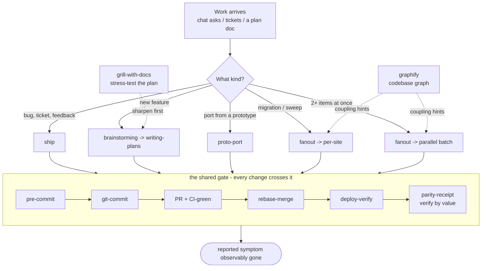

# Shaheer's Claude Code config

A curated, **public-safe** slice of my `~/.claude`: the skills, subagents, hooks, and the
`CLAUDE.md` harness I actually work with. Shared so you can see the setup and lift what's useful,
and so I can sync it across my own machines.

> This is deliberately **not** a full `~/.claude` mirror. The private half — `memory/`,
> `.credentials.json`, `settings.json`, session history — is never committed here. What's in this
> repo is only the authored, generic pieces meant to be shared.

## Layout

```
skills/     24 skills (dev pipeline, planning, design tooling, utilities)
agents/     5 subagents (auditors + validators + test runner)
hooks/      pre-compact snapshot hook (pairs with system-explainer)
CLAUDE.md   the pipeline harness — how work gets routed through skills + verified
```

## How work flows

Every dev task routes through a matching skill, then each change crosses **one shared verification gate**. (This diagram renders directly on GitHub.)



## Install

Copy the pieces you want into your own `~/.claude/`:

```bash
cp -R skills/*  ~/.claude/skills/
cp -R agents/*  ~/.claude/agents/
cp -R hooks/*   ~/.claude/hooks/
# CLAUDE.md is a starting harness — merge it into your own, don't blindly overwrite:
#   cp CLAUDE.md ~/.claude/CLAUDE.md
```

Restart Claude Code and it discovers `skills/` and `agents/`. Each folder's `SKILL.md` (and each
agent's frontmatter) documents itself — that's the source of truth. The `CLAUDE.md` here is the
*generic* harness; keep your own project-specific facts in a private overlay, not in this file.

## What's here

### Skills — the dev pipeline
- `ship` — the work-set execution loop: land a set of changes end to end under verification guardrails.
- `fanout` — the batching decision: parallel vs serialize, wave schedule, per-item risk tier.
- `graphify` — a local AST knowledge graph of a codebase (what-renders-what).
- `pre-commit` — runs the project's real gate commands (typecheck / lint / tests) fail-closed before any "done" claim.
- `git-commit`, `pr-creator`, `github-pr-review` — identity-aware commits, PR creation, PR review via the gh CLI.
- `proto-port` — build/port a surface FROM a prototype (the proto code is the spec) to leaf-level parity. *(was `parity-builder`)*
- `parity-receipt` — verify a built UI against its prototype without missing behind-a-click detail (dropdowns, modals, row-click destinations). *(was `parity-sweep`)*
- `session-handoff` — a structured end-of-session summary so a fresh session continues.
- `setup-audit` — grades your `~/.claude` setup and catches silent breakage.

### Skills — design
- `design-audit` / `design-drift` — document the design system a codebase already has, and bring it back in line.
- `hue` — a meta-skill that generates new design-language skills.
- `frontend-design`, `web-design-guidelines`, `visual-explainer` — UI guidance, a Web Interface Guidelines review, and self-contained HTML explainers.

### Skills — misc
- `codex` — a cross-model second opinion on a diff via the OpenAI Codex CLI.
- `watch` — watches a video and answers questions about it.
- `system-explainer` — teaches how an unfamiliar system works; can generate a standalone onboarding web app (ships a public **Zustand** demo course).
- `find-skills` — discovers/installs skills.

### Skills — planning & domain modeling
A planning trio by [@mattpocock](https://github.com/mattpocock) (install via `npx skills add mattpocock/skills@<name>`; bundled here for convenience, credit to him):
- `grill-with-docs` — a relentless interview that stress-tests a plan or design and captures ADRs + a glossary as you go.
- `grilling` — the interrogation engine: grill a plan / decision / idea until the thinking is sharp.
- `domain-modeling` — pin down the ubiquitous language and record architectural decisions.

### Agents (`agents/`)
Generic dev subagents you can dispatch: `code-auditor` (quality/maintainability), `dep-auditor`
(outdated/vulnerable/unused deps), `deploy-checker` (pre-deploy validation), `env-validator`
(`.env` vs `.env.example`, secret leaks), `test-runner` (TS/lint/unit tests).

### Hooks (`hooks/`)
`pre-compact-teaching-snapshot.sh` — a `PreCompact` hook that leaves a marker for the
`system-explainer` skill so a post-compaction session knows recent context may be stale. Wire it via
a `PreCompact` entry in `~/.claude/settings.json`.

### CLAUDE.md
The harness that routes any multi-step dev work through the right skill, slices work into
minimum-shippable PRs, and enforces the "no unverified *fixed*" discipline (reproduce first, assert
by value on the deployed build). Adapt it; it references some skills that live outside this repo.

## Setup notes
- `watch` uses `GROQ_API_KEY` or `OPENAI_API_KEY` in `~/.config/watch/.env` (Whisper fallback only; captions work without it).
- `codex` needs the OpenAI Codex CLI (`npm i -g @openai/codex`).
- `system-explainer/onboarding-template` ships source only — run `npm install` inside it (`node_modules` is gitignored).
- Related but separate: my verification layer `receipts` is a public plugin — `claude plugin marketplace add shaheershoaib/receipts` then `claude plugin install receipts`. (Its Stop hooks live in that plugin, not here.)

## Not included: security-audit / VibeSec
I run a `security-audit` skill locally, but it's the **paid VibeSec Pro** (purchased, proprietary,
no redistribution license) — not mine to hand over. Get VibeSec directly:
- **Free** (Apache-2.0, ~60–70% coverage): https://github.com/BehiSecc/VibeSec-Skill
- **Pro** (fuller coverage, one-time payment): https://vibesec.sh

Everything else here is fair game.
